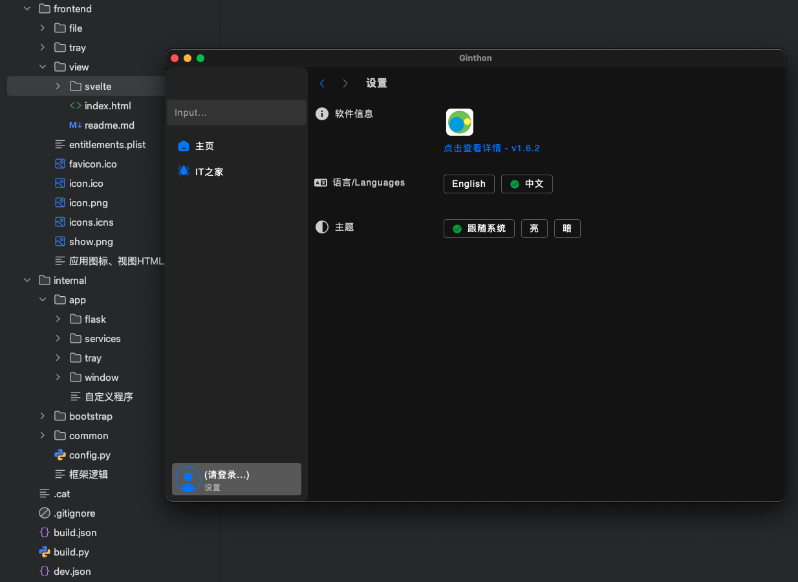

### Ginthon是用Python+Web写的“视图窗口+稳定服务”的桌面端多功能程序基建。
```
代码习惯基于Golang（无复杂继承和类）。

Ginthon基于pywebview、flask等。无PyQT。ApacheV2 License。

前端默认Svelte5。

代码目前只在Git^hu^b上发布（防^爬说明20251116）。

开源地址：https://github.com/fyonecon/Ginthon 。
```

### 老一辈艺术家坚持手搓：

Python版基座请戳：https://github.com/fyonecon/Ginthon 。

Golang版基座请戳：https://github.com/fyonecon/Waigo 。

Go和PY都是以“尽量返回默认值来代替‘抛出Err’”+“尽量复用函数”+“尽量不使用继承”为原则。

---

### 程序要求：
```
需要 Python3.12+

需要 webview2或webkit基础环境

已适配macOS12+、Win10+。Linux环境尚未验证。

开发IDE PyCharm（推荐）

```

### 拉取仓库：
窗口及服务·主程序（Ginthon-Main）：
> git clone -b main https://github.com/fyonecon/Ginthon.git Ginthon-Main

### 【自动】开发环境运行项目（🔥）：
> python dev.py

### 【自动】打包成桌面安装包（仅打包当前"CPU类型+操作系统类型"的安装包）（🔥）：
> python build.py

---

### 【手动】初始化项目：
1. 安装.venv虚拟环境：
```
以PyCharm为例：

（删除老.venv，有就删除）-- 设置 -- Python -- Interpreter -- Add Interpreter -- Add local interpreter -- Generate New -- 创建新的.venv即可。
```

2. 初始化项目py依赖（🔥）：
> pip install -r requirements.txt

3. 导出或更新项目所有依赖（🔥）：
> pip freeze > requirements.txt

4. 清除不必要的项目依赖：
```
删除.venv文件夹，重新初始化项目依赖即可.
```
5. 安装npm依赖及项目node_modules：
> cd ./frontend/view/svelte
> 
> (npm install pnpm 已废弃)
> 
> npx sv add tailwindcss
> 
> npm install
>

### 【手动】开发环境逐步运行项目：
1. 开发环境运行视图UI：
> cd ./frontend/view/svelte
> 
> npx sv add tailwindcss
> 
> (pnpm install 已废弃)
> 
> npm run dev

2. 开发环境直接运行状态栏托盘：
> python tray.py

3. 开发环境运行软件（加载localhost pnpm动态文件）：
> python window.py --cmd dev

4. 开发环境运行软件（加载127.0.0.1 dist静态文件）：
> python window.py --cmd build

(注意，直接运行“python window.py” == “python window.py --cmd build”，window.py加载的是svelte的dist静态文件，使用127.0.0.1域名。而“python window.py --cmd dev”加载的是svelte的“pnpm run dev”本地localhost网页。)

### 【手动】打包程序为程序安装包：
1. 生成视图UI dist静态文件：
> cd ./frontend/view/svelte
> 
> pnpm run build

2. 打包成桌面安装包：
> pyinstaller --clean window.spec
> 

### 其它：打包成安装程序（win、mac、linux）：
（如有需要请手动删除/dist/ 和 /build/ 文件夹）
（只能打包当前平台CPU结构的程序。也可以使用“python build.py”命令一键打包）
> 
> pyinstaller --clean window.spec 
>

### 视图UI配置教程（Svelte、VUE）：
🔥请查看本目录文件/frontend/view/README.md

### 状态栏托盘Tray运行原理：
原理：由于视图主程序已经是主线程，mac中不能存在第二主线程（NSWindow影响）。所以本程序在视图主程序中以多线程的方式，利用shell拉起打包成二进制的Tray程序。

在开发的过程中，运行dev.py或build.py都会自动执行打包程序，无需担心window主程序没有挂载“tray_create()”。

dev过程：打包Tray二进制文件--将二进制文件移动到frontend/tray文件夹--启动pnpm--启动window--shell启动二进制文件。

build过程：打包Tray二进制文件--将二进制文件移动到frontend/tray文件夹--pnpm打包视图UI--打包frontend+PY文件。

### 项目结构：
```
Ginthon-Main
├── frontend 前端或静态文件
│   ├── file 放其他web文件，额外的web文件
│   ├── tray （状态托盘二进制文件，自动创建）
│   └── view 前端视图（可多视图框架切换）
│       └── svelte 视图UI（默认SvelteKit）
│           ├── src 视图发开发文件
│           │   └── common 公共函数
│           │   └── pages 页面具体实现
│           │   └── parts 公用Svelte组件
│           │   └── stores 绑定数据管理
│           │   └── routes 路由、layout、公共参数验证
│           ├── config.js 配置文件
│           └── static 静态文件
│       ├── vue 视图UI（查看文件/frontend/view/README.md）
│       ├── index.html （单页应用请使用此文件）
│       ├── readme.md 🔥前端操作记录与教程
├── internal 后段时间或py核心代码
│   ├── app 自定义的App功能
│   │   ├── flask Web接口目录
│   │   ├── services 系统服务目录
│   │   │   ├── services_for_open_tray.py 启动tray
│   │   │   └── services_for_time_interval.py 定时器
│   │   ├── tray 状态栏托盘
│   │   └── window 窗口服务目录
│   │       ├── controller
│   │       │   ├── do_events.py 操作窗口事件
│   │       │   ├── js_call_py.py js调用py对照表
│   │       │   ├── on_events.py 窗口运行事件
│   │       │   ├── py_run_js.py py调用js对照表
│   │       │   └── tray_events.py
│   │       ├── window_route.py 窗口必要页面相关路由
│   │       └── window_view.py 窗口页面html代码
│   ├── bootstrap 框架加载核心
│   │   ├── app_auth.py 认证与密钥相关
│   │   ├── flask_middleware.py Web检测中间件
│   │   ├── init_sys.py 检查系统及硬件
│   │   ├── init_window.py 窗口服务
│   │   ├── run_check_sys.py
│   │   ├── run_flask.py Web服务
│   │   ├── run_tray.py 启动状态栏托盘
│   │   └── run_services.py 其它主页服务
│   ├── common 公共函数、封装的kit
│   │   ├── func.py 公共函数
│   │   ├── kits 公共函数的Kit
│   │   │   ├── _7z.py 7Z解压
│   │   │   ├── FILETYPE_DICT.py 各种文件对照表
│   │   │   ├── ICON.py 程序icon的二进制
│   │   │   ├── main_dirpath.py 虚拟路径
│   │   │   ├── secret_aes.py 对称加密
│   │   │   ├── shell.py PY运行shell
│   │   │   ├── time_interval.py 定时器
│   │   │   ├── txt_data.py 简单的文件型数据库
│   │   │   ├── watch_pid.py
│   │   │   └── watch_processes.py
│   │   └── translate.py 翻译对照表
│   └── config.py 系统配置信息
├── LICENSE
├── README.md 项目说明
├── requirements-win.txt Win下的依赖
├── requirements.txt 默认依赖
├── build.json 打包程序的配置文件
├── build.py 打包程序
├── dev.json 开发环境运行的配置文件
├── dev.py 开发环境一键运行
├── tray.py 状态栏托盘入口
├── window.py 视窗主程序入口
└── window.spec PYinstaller的SPEC打包文件参数
```

### 运行效果：


---

### Python教程：

> Python3:https://www.runoob.com/python3/python-queue.html
>
> Flask：https://flask.palletsprojects.com/en/stable/installation/#install-flask
>
> PyWebview：https://pywebview.idepy.com/guide/usage.html
>
> Skeleton UI：https://www.skeleton.dev/docs/svelte/guides/mode
> 
> Tailwind CSS：https://www.tailwindcss.cn/docs/installation
> 
> Iconify SVG：https://icon-sets.iconify.design/

### 常用pip安装库：
如果遇到网络忙或者下载错误，多试几次，不需要更换镜像源（使用官方源即可）。
#### 爬虫
```
pip3 install requests

pip3 install beautifulsoup4

pip3 install lxml

pip3 install fake-useragent
 
pip3 install asyncio

pip3 install httpx
 
pip3 install selenium
 
pip3 install scrapy

pip3 install Playwright

pip3 install pyinstaller

pip3 install py7zr

```

#### 服务或框架
```
pip3 install flask

pip3 install pywebview

pip3 install schedule

pip3 install pystray

pip3 install pycryptodome

```

#### 读写office文件
```
pip3 install xlrd
 
pip3 install xlwt
 
pip3 install xlutils

pip3 install xlwings
 
pip3 install XlsxWriter
 
pip3 install openpyxl
 
pip3 install pandas
```

### Mac安装Homebrew国内源
#### 苹果电脑安装脚本（选择清华大学镜像）：
> /bin/zsh -c "$(curl -fsSL https://gitee.com/cunkai/HomebrewCN/raw/master/Homebrew.sh)"

#### 苹果电脑卸载脚本：
> /bin/zsh -c "$(curl -fsSL https://gitee.com/cunkai/HomebrewCN/raw/master/HomebrewUninstall.sh)"

### 安装Python

安装Python：
参考：https://geek-blogs.com/blog/how-to-uninstall-and-reinstall-python-mac/

方法1；使用官方安装包安装（不推荐）：
下载安装包：https://www.python.org/downloads/

方法2: 使用brew（推荐）:
> brew install python@3.12
> 
> brew install python@3.14

查看安装的版本：
> python3 --version
> pip3 --version

### 卸载Python

1. 官方安装包安装的： 

找到 Python 安装目录：
> sudo rm -rf /Library/Frameworks/Python.framework/Versions/3.x

注意：3.x 是你要卸载的 Python 版本号，如 3.9 等
删除相关的应用程序：
> sudo rm -rf /Applications/Python\ 3.x

2. brew方法安装的：
> brew uninstall python@3.12
> 
> brew uninstall python@3.14

### 开发工具IDE：pycharm-community：
不推荐使用vscode。
> https://www.jetbrains.com.cn/edu-products/download/download-thanks-pce.html
> 
>（https://download.jetbrains.com/python/pycharm-community-2025.2.4.exe ）
> 
>（https://download.jetbrains.com/python/pycharm-community-2025.2.4.dmg ）
> 
>（https://download.jetbrains.com/python/pycharm-community-2025.2.4-aarch64.dmg ）


# start 2025-11-15