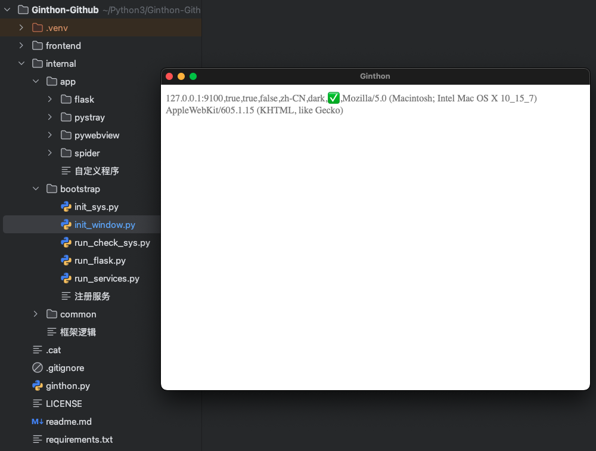

## Ginthon是用Python写的“视图窗口+稳定服务”的多功能程序基建
```
代码习惯基于Golang。

代码目前只在Git^hu^b上发布（防^爬说明20251116）。

框架地址：https://github.com/fyonecon/Ginthon 
```

### 程序目标：
```
需要 Python3.12+

需要 webview或webkit基础环境

适配 Mac、Win、Linux

开发IDE PyCharm（推荐）

window是主程A，tray是主程B，A启动B可执行文件
```

### 项目目录介绍：
```
Ginthon-Main
├── frontend 前端或静态文件
│   ├── file 其他文件
│   ├── js_call_py.js js调用py的对照表
│   ├── tray
│   └── view 前端文件
│       ├── index.html （也是窗口html代码）
├── internal 后段时间或py核心代码
│   ├── app 自定义的App功能
│   │   ├── flask Web接口目录
│   │   ├── services 系统服务目录
│   │   │   ├── services_for_open_tray.py
│   │   │   └── services_for_time_interval.py
│   │   └── window 窗口服务目录
│   │       ├── controller
│   │       │   ├── do_events.py 操作窗口事件
│   │       │   ├── js_call_py.py js调用py对照表
│   │       │   ├── on_events.py 窗口运行事件
│   │       │   ├── py_run_js.py py调用js对照表
│   │       │   └── tray_events.py
│   │       ├── window_route.py 窗口必要页面相关路由
│   │       └── window_view.py 窗口页面html代码
│   ├── bootstrap 框架加载核心
│   │   ├── app_auth.py 认证与密钥相关
│   │   ├── flask_middleware.py Web检测中间件
│   │   ├── init_sys.py 检查系统及硬件
│   │   ├── init_window.py 窗口服务
│   │   ├── run_check_sys.py
│   │   ├── run_flask.py Web服务
│   │   └── run_services.py 其它主页服务
│   ├── common 公共函数
│   │   ├── func.py 公共函数
│   │   ├── kits 公共函数的Kit
│   │   │   ├── _7z.py 7Z解压
│   │   │   ├── FILETYPE_DICT.py 各种文件对照表
│   │   │   ├── ICON.py 程序icon的二进制
│   │   │   ├── main_dirpath.py 虚拟路径
│   │   │   ├── secret_aes.py 对称加密
│   │   │   ├── shell.py PY运行shell
│   │   │   ├── time_interval.py 定时器
│   │   │   ├── txt_data.py 简单的文件型数据库
│   │   │   ├── watch_pid.py
│   │   │   └── watch_processes.py
│   │   └── translate.py
│   └── config.py 系统配置信息
├── LICENSE
├── readme.md
├── requirements-win.txt Win下的依赖
├── requirements.txt 默认依赖
├── show.png
├── window.py 程序入口
└── window.spec PYinstaller的SPEC打包文件参数
```

### Python教程：
```
Python3:
https://www.runoob.com/python3/python-queue.html

Flask：
https://flask.palletsprojects.com/en/stable/installation/#install-flask

PyWebview
https://pywebview.idepy.com/guide/usage.html

爬虫大纲：
https://jishuzhan.net/article/1963161837455327233
```

### 初始化项目：
1. 安装.venv虚拟环境：
```
以PyCharm为例：

（删除老.venv，有就删除）-- 设置 -- Python -- Interpreter -- Add Interpreter -- Add local interpreter -- Generate New -- 创建新的.venv即可。
```

2. 初始化项目依赖：
> pip install -r requirements.txt

### 导出或更新项目所有依赖（🔥）：
> pip freeze > requirements.txt

### 清除不必要的项目依赖：
```
删除.venv文件夹，重新初始化项目依赖即可.
```

### 拉取仓库：
视图及服务·主程序（Ginthon-Main）：
```
git clone -b main https://github.com/fyonecon/Ginthon.git Ginthon-Main
```

状态栏托盘·次程序（Ginthon-Tray）：
```
git clone -b tray https://github.com/fyonecon/Ginthon.git Ginthon-Tray
```


### 运行项目：
> python main.py

### 打包成安装程序（win、mac、linux）：
> （手动删除/dist/ 和 /build/ 文件夹）
> 
> pyinstaller --clean window.spec （只能打包当前平台CPU结构的程序。）
>  
> 或
> 
> pyinstaller --clean tray.spec （只能打包当前平台CPU结构的程序。）
> 

### 运行效果：



### 常用pip安装库
如果遇到网络忙或者下载错误，多试几次，不需要更换镜像源（使用官方源即可）。
#### 爬虫
```
pip3 install requests

pip3 install beautifulsoup4

pip3 install lxml

pip3 install fake-useragent
 
pip3 install asyncio

pip3 install httpx
 
pip3 install selenium
 
pip3 install scrapy

pip3 install Playwright

pip3 install pyinstaller

pip3 install py7zr

```

#### 服务或框架
```
pip3 install flask

pip3 install pywebview

pip3 install schedule

pip3 install pystray

pip3 install pycryptodome

```

#### 读写office文件
```
pip3 install xlrd
 
pip3 install xlwt
 
pip3 install xlutils

pip3 install xlwings
 
pip3 install XlsxWriter
 
pip3 install openpyxl
 
pip3 install pandas
```

### Mac安装Homebrew国内源
#### 苹果电脑安装脚本（选择清华大学镜像）：
> /bin/zsh -c "$(curl -fsSL https://gitee.com/cunkai/HomebrewCN/raw/master/Homebrew.sh)"

#### 苹果电脑卸载脚本：
> /bin/zsh -c "$(curl -fsSL https://gitee.com/cunkai/HomebrewCN/raw/master/HomebrewUninstall.sh)"


### 下载安装包：pycharm-community（不推荐使用vs code）：
> https://www.jetbrains.com.cn/edu-products/download/download-thanks-pce.html
> 
>（https://download.jetbrains.com/python/pycharm-community-2025.2.4.exe ）
> 
>（https://download.jetbrains.com/python/pycharm-community-2025.2.4.dmg ）

### 安装Python

安装Python：
参考：https://geek-blogs.com/blog/how-to-uninstall-and-reinstall-python-mac/

方法1；使用官方安装包安装（不推荐）：
下载安装包：https://www.python.org/downloads/

方法2: 使用brew（推荐）:
brew install python@3.12
brew install python@3.14

查看安装的版本：
python3 --version
pip3 --version

### 卸载Python

1. 官方安装包安装的： 

找到 Python 安装目录：
> sudo rm -rf /Library/Frameworks/Python.framework/Versions/3.x

注意：3.x 是你要卸载的 Python 版本号，如 3.9 等
删除相关的应用程序：
> sudo rm -rf /Applications/Python\ 3.x

2. brew方法安装的：
> brew uninstall python@3.12
> 
> brew uninstall python@3.14


# start 2025-11-15